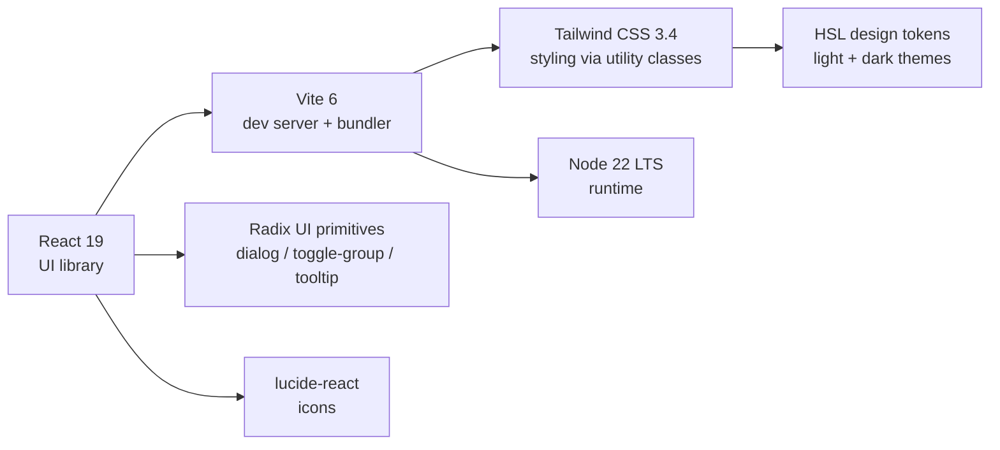
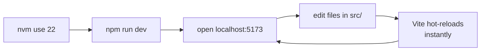
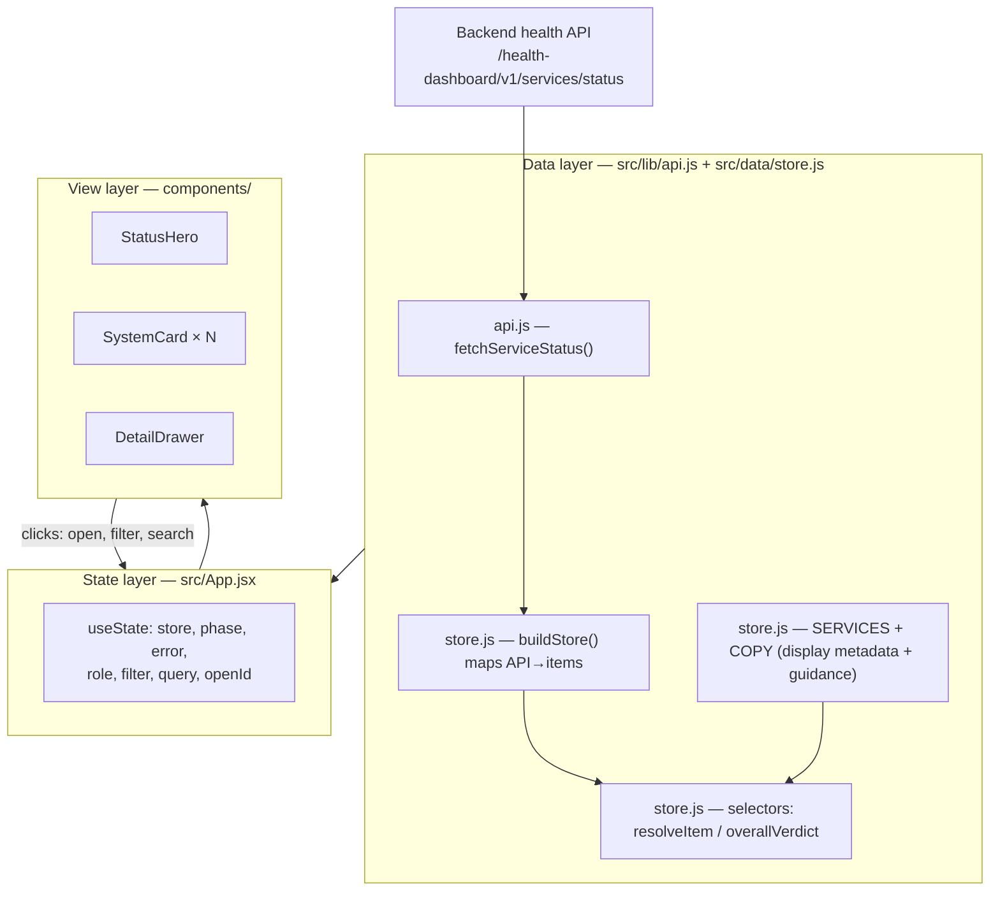
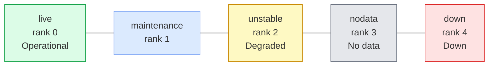
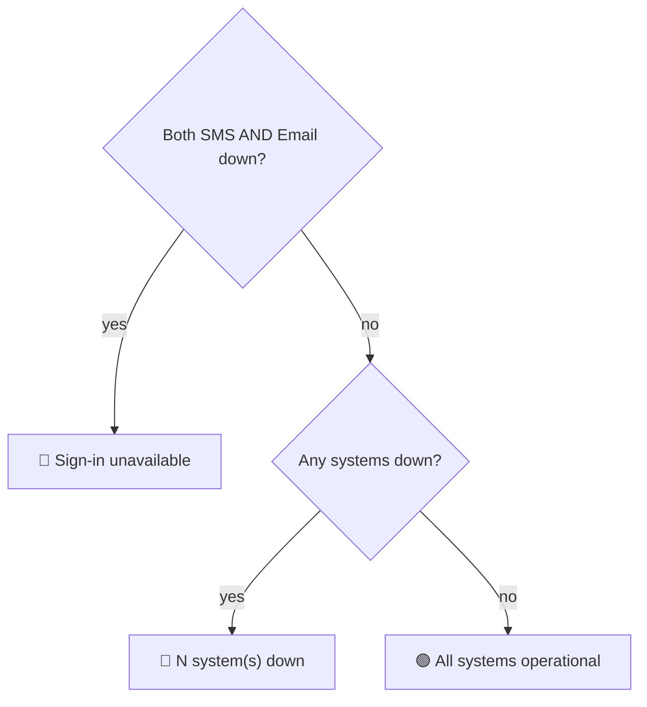
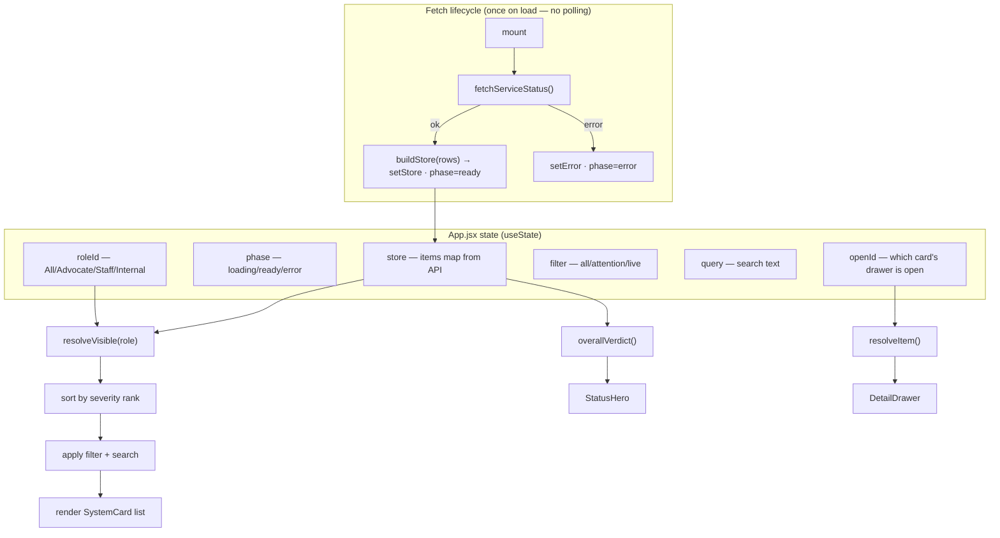
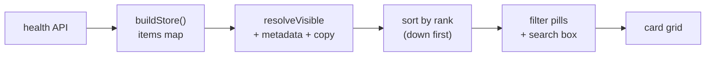
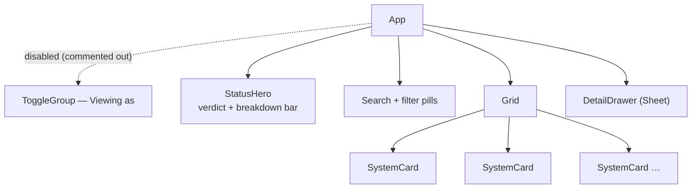
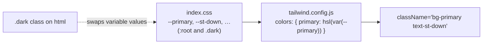

# OnCourts — Integration Status Dashboard · Developer Guide

A complete walkthrough of this codebase for a developer picking it up for the
first time. Covers **what** it is, **why** it exists, and **how** it is wired
together.

> **TL;DR** — A React dashboard that shows the **live** health of OnCourts'
> external integrations (e-Payment, SMS, e-Sign, iCOPS, …). Statuses are fetched
> from the backend health API (`src/lib/api.js`) and mapped onto display metadata
> + authored guidance copy in `src/data/store.js`. It fetches once on page load
> (no polling) and is configured per environment (dev/UAT/prod) via `.env` files.

---

## 1. Background — why this project exists

Tracked in [dristi#5807 "Public-Facing Health Dashboard"](https://github.com/pucardotorg/dristi/issues/5807).

Users of the Kerala Courts platform need a page that tells them, in plain
language, **which integrations are working and what to do when one is down**
(e.g. "e-Payment is down — please retry later; avoid repeat attempts to prevent
a double charge").

The work splits in two:

| Part | Status | This repo |
|---|---|---|
| **Backend** polling service + status API | *live* (`/health-dashboard/v1/services/status`) | ❌ separate repo |
| **Frontend** public status page (responsive) | *integrated with the live API* | ✅ **this repo** |

The frontend fetches live status from the backend health API. It still **authors
the display copy** (human-friendly names, capability/consequence lines, impact +
"what you can do" guidance, and which perspective sees each service) in
`src/data/store.js` — the API only supplies status, timestamps, response time and
a short probe message.

### Live API contract

`GET {host}/health-dashboard/v1/services/status` → array of:

```json
{ "id": 12, "serviceName": "ICOPS", "serviceUrl": "tcp://…:443",
  "lastStatus": "DOWN", "lastUpdatedTime": 1783507511893,
  "responseTimeMs": 11087, "message": "Connect timed out" }
```

- `lastStatus` `UP`→Operational, `DOWN`→Down (also maps `DEGRADED`→Degraded,
  `MAINTENANCE`, `UNKNOWN`→No-data for the future).
- `serviceName` is mapped to an internal id via `SERVICE_ID_BY_API`
  (`TREASURY`→`epayment`, `ESIGN`→`esign`, `SMS`→`sms`, `ICOPS`→`icops`, …).
- `lastUpdatedTime` is the last **poll** time, shown as an absolute IST time
  ("Last updated at 10:47 AM", or "… 29/06/2026 10:47 AM" if not today) via
  `formatUpdatedAt()`. The API doesn't yet send an outage-*start* time, so cards
  don't show "since HH:MM" — when the backend adds it, populate `since` in
  `buildStore()` and it renders.

### Scope decisions locked in the ticket (reflected in the code)

- **Statuses:** only **Down** and **Operational** today (`UP`/`DOWN` from the API);
  Degraded / Maintenance / No-data exist in the data model for the future.
- **Snapshot only** — no historical uptime graphs; fetched once per page load.
- **No action-blocking** — the dashboard never blocks payments/e-sign; it only *informs*.
- **Perspectives** — All · Advocate · Court staff · Internal exist in the data model
  (`audience`), but the **"Viewing as" switcher is currently commented out in
  `App.jsx`** (only *All* is shown) until there's more than one role worth
  exposing. Re-enable by uncommenting the block — the logic still works.

---

## 2. Tech stack



| Layer | Choice | Why |
|---|---|---|
| Framework | **React 19** | Latest; hooks-only, no class components. |
| Build tool | **Vite 6** | Fast dev server + HMR; simple config. |
| Styling | **Tailwind CSS 3.4** | Utility-first; design tokens map 1:1 to the Figma handover. |
| Primitives | **Radix UI** | Accessible, unstyled dialog/toggle/tooltip (the shadcn/ui pattern). |
| Icons | **lucide-react** | Clean, tree-shakeable SVG icons. |
| Runtime | **Node 22 LTS** | Required by Vite 6 (Node 18+). |

> **Why Tailwind v3.4 and not v4?** v3.4's `tailwind.config.js` token model maps
> directly to the handover's colour variables, guaranteeing pixel fidelity. A v4
> migration is possible later but wasn't needed for v1.

---

## 3. Getting started

```bash
# 1. Use the right Node (your machine's default node may be too old for Vite)
nvm use 22                       # needs Node 18+, tested on 22.22

# 2. Install dependencies (only once, or after dependency changes)
npm install

# 3. Run the dev server
npm run dev                      # http://localhost:5173

# Other commands
npm run build                    # production build → dist/
npm run preview                  # serve the production build locally
```

> 💡 Run `nvm alias default 22` once so new terminals default to Node 22 and you
> can skip `nvm use 22` every time.

### Everyday loop



---

## 4. Directory structure

```
public-health-dashboard/
├── index.html                 # HTML shell; loads Noto Sans font + main.jsx
├── package.json               # deps + scripts
├── vite.config.js             # Vite + the "@" → "src" path alias
├── tailwind.config.js         # design tokens (colours, fonts, radius)
├── postcss.config.js          # runs Tailwind + autoprefixer
├── README.md                  # quick start
├── PROJECT_GUIDE.md           # (this file)
└── src/
    ├── main.jsx               # React entry — mounts <App/> into #root
    ├── index.css              # Tailwind layers + CSS design tokens (:root / .dark)
    ├── App.jsx                # page shell: fetch/poll, state, layout   ← the brain
    ├── data/
    │   └── store.js           # API→UI mapping + display copy + selectors ← the data layer
    ├── lib/
    │   ├── api.js             # health-API client (fetch + endpoint URL from env)
    │   ├── utils.js           # cn() — merges Tailwind class strings
    │   └── ui.jsx             # status→colour map, IST time helpers, StatusDot/Badge
    └── components/
        ├── StatusHero.jsx     # "Integration health" summary + breakdown bar
        ├── SystemCard.jsx     # one integration tile
        ├── DetailDrawer.jsx   # slide-in detail panel
        └── ui/                # Radix-based primitives (shadcn/ui style)
            ├── button.jsx
            ├── sheet.jsx          # the slide-in drawer container
            ├── toggle.jsx         # shared toggle styles (variants)
            ├── toggle-group.jsx   # the "Viewing as" / filter pills
            └── tooltip.jsx
```

### Mental model: three layers



**The key idea:** components are dumb renderers. Live status enters through
`api.js`, is shaped by `store.js`, and `App.jsx` holds the current selections.
The API supplies *status*; `store.js` supplies the *words* around it.

---

## 5. The data layer — `src/lib/api.js` + `src/data/store.js`

`api.js` fetches the live status; `store.js` defines the domain, maps the API
response onto it, and derives what the UI shows.

### 5.1 Status taxonomy

```js
STATUS = { live, maintenance, unstable, nodata, down }   // each has a `rank`
```

`rank` drives sort order (most severe first). The backend currently sends only
`UP`/`DOWN` (→ `live`/`down`); `unstable`/`maintenance`/`nodata` are mapped and
ready for when the backend emits them.



### 5.2 The catalogue — `SERVICES`

Six monitored integrations. Each row declares its metadata:

| id | name | vendor | needsAuth | audience |
|---|---|---|---|---|
| `epayment` | e-Payment | e-Treasury | ✅ | everyone |
| `sms` | SMS | CDAC | — | everyone |
| `email` | Email | NIC | — | everyone |
| `esign` | e-Sign | CDAC / CCA | ✅ | everyone |
| `aadhaar` | Aadhaar Auth | UIDAI | — | everyone |
| `icops` | iCOPS | State Police | — | court only |

- **`audience`** controls role visibility — `icops` is court-only, so Advocates never see it.
- **`needsAuth`** means "this service needs OTP login to work" — used to show a
  cascade warning ("Sign-in is down, so this will also fail").
- **`capability`** = what it does (shown when healthy); **`affects`** = the
  consequence (shown when down).

### 5.3 Authored copy — `COPY`

For each service × non-operational status, human-written **impact** text and a
list of **actions** (`{ a: "user" | "team", t: "..." }`). Only `a: "user"`
actions show in the public "What you can do" list. The API doesn't provide this
guidance — it's authored here and merged with the live status in `resolveItem`.

### 5.4 API → store mapping — `buildStore()` + `SERVICE_ID_BY_API`

`buildStore(apiRows)` turns the API array into the `items` map the selectors
consume, keyed by our internal id:

```
API row  { serviceName:"ICOPS", lastStatus:"DOWN", lastUpdatedTime, responseTimeMs, message, serviceUrl }
   │  SERVICE_ID_BY_API["ICOPS"] → "icops"   ·   normalizeStatus("DOWN") → "down"
   ▼
items.icops = { status:"down", since:null, lastChecked:lastUpdatedTime,
                apiMessage, responseTimeMs, serviceUrl, apiServiceName, apiId }
```

- Unknown `serviceName`s get a slug id + fallback metadata, so a new backend
  service still renders (just without authored copy) instead of breaking.
- `since` is `null` (the API sends last-*poll* time, not outage-*start*).

### 5.5 Selectors — deriving what the UI shows

Pure functions that turn raw records into render-ready data:

- **`resolveItem(id, items, now)`** — merges a service's metadata + record +
  authored copy into one object (adds `impact`, `actions`, `cascade`, duration…).
- **`resolveVisible(items, now, role)`** — the list for the current role.
- **`overallVerdict(items, now, role)`** — the hero headline.
- **`loginState(items)`** — is sign-in possible? (SMS **or** Email up).

### 5.6 The verdict decision tree

How the big headline at the top is chosen:



`loginState` is special-cased because if both OTP channels are down, **nobody
can log in** — a bigger deal than "2 systems down", so it gets its own headline.

---

## 6. The state layer — `src/App.jsx`

`App.jsx` fetches the live status, owns all interactive state, and passes data
down as props.



### Data pipeline (API → pixels)



### Fetch behaviour & interactions

| Thing | How it works |
|---|---|
| **Load** | fetches **once** on mount; `phase = "loading"` → spinner until the response. **No polling.** |
| **Load fails** | full-page error + a **Try again** button (only shown when there's no data — equivalent to reloading). |
| **Newer data** | the user reloads the page. The backend refreshes its own table on an interval; each card's "Last updated at &lt;time&gt;" (from `lastUpdatedTime`) shows how fresh each service's status is. |
| **Timestamps** | shown as absolute IST via `formatUpdatedAt()` — no relative "…ago" and no ticking clock, so nothing recalculates after load. |
| **Viewing as** pills | `setRoleId` — changes which services are visible (by `audience`). *Currently commented out in `App.jsx`; `roleId` stays `"all"`.* |
| **Filter pills / search** | `setFilter` / `setQuery` — narrows the grid client-side. |
| **Click a card** | `setOpenId` — opens the detail drawer. |

> There is intentionally **no public "refresh" or "re-check" button** — per the
> ticket, a public refresh could be abused, so we don't poll and don't expose a
> refresh control. A manual/admin re-check would be a future, access-controlled
> addition.

---

## 7. The view layer — components



- **`StatusHero.jsx`** — the page anchor. Shows the verdict headline + a
  parts-of-whole "status breakdown" bar (desktop: labelled segments; mobile:
  continuous bar + legend). No refresh control.
- **`SystemCard.jsx`** — one integration. Status leads the read via a coloured
  **label + left rail** (never colour alone → accessible). Down cards get a red
  tint. Footer shows **"Last updated at &lt;time&gt;"** (absolute IST) for that service.
- **`DetailDrawer.jsx`** — a Radix Dialog rendered as a right-side **Sheet**
  (full-screen on mobile). Shows status badge, "Last updated at", plain-language
  impact, optional cascade/note, "What you can do", the live probe **"Last check"**
  message (+ response time), and **Report a problem**.
- **`components/ui/*`** — the shadcn/ui-style Radix primitives. You rarely touch
  these; they're the accessible building blocks (`Button`, `Sheet`,
  `ToggleGroup`, `Tooltip`).

---

## 8. Styling & theming — `index.css` + `tailwind.config.js`

Colours are **HSL CSS variables** defined twice — once under `:root` (light) and
once under `.dark`. Tailwind maps semantic class names to those variables.



- **Semantic tokens:** `background`, `foreground`, `card`, `primary` (eCourts
  teal), `muted-foreground`, `border`, …
- **Status tokens:** `st-live`, `st-down`, `st-unstable`, `st-maint`, `st-nodata`
  — each with a base text colour, a soft `-bg` fill, and a `-bd` border.
- **Dark mode** = the full `.dark` token set exists in `index.css`, so the whole
  UI themes by toggling a `.dark` class on `<html>`. There is **no dark-mode
  toggle in the UI right now** (the earlier toggle was removed); the tokens are
  ready if/when a theme switch is reintroduced.

The `STATUS_UI` map in `lib/ui.jsx` is the single source that ties a status id to
its label + Tailwind classes:

```js
STATUS_UI.down = { label: "Down", text: "text-st-down",
                   badge: "border-st-down-bd bg-st-down-bg text-st-down",
                   dot: "bg-st-down" }
```

---

## 9. Accessibility notes (built in, keep them)

- **Status never relies on colour alone** — always label + colour + position (the left rail).
- High-contrast text (no faint grey), visible borders (bad-monitor friendly).
- Cards are keyboard-operable (`role="button"`, Enter/Space open the drawer).
- Focus rings on every interactive element; Radix handles focus-trapping in the drawer.
- Respects `prefers-reduced-motion` (the entrance animation disables itself).

---

## 10. How to extend

### Add a new integration
1. Backend starts returning it in the status array (new `serviceName`).
2. Add the API→id mapping in `SERVICE_ID_BY_API` and a row in `SERVICES`
   (id, name, vendor, capability, affects, audience) in `store.js`.
3. Add its `COPY[id]` block (impact + actions per non-operational status).
4. Done — it appears automatically. (Even without steps 2–3 it renders with a
   fallback name and no guidance, so it never breaks the page.)

### Point at a different backend / environment
- Edit the `.env.*` file for that environment (`VITE_API_BASE_URL`,
  `VITE_HEALTH_STATUS_PATH`). See §3 and the README.

### Likely next backend-driven features
- **Outage start time** — when the API adds it, set `since` in `buildStore()`;
  the "since HH:MM" line and drawer timing light up automatically.
- **Degraded/maintenance** — already mapped in `normalizeStatus`; the moment the
  API emits `DEGRADED`/`MAINTENANCE` those states render.
- **Admin override / manual re-check** — the ticket wants these access-controlled
  (not public). Add behind auth; the current UI deliberately has no public
  refresh button.

---

## 11. What was built (change log)

- **Scaffolding:** Vite + React 19; `@`→`src` alias; Tailwind 3.4 + PostCSS.
- **Design tokens:** full light/dark HSL token set in `index.css`.
- **UI primitives:** Radix-based `button`, `sheet`, `toggle`, `toggle-group`, `tooltip`.
- **UI from the Figma handover:** adaptive status hero + breakdown bar,
  searchable/filterable card grid, detail drawer, responsive desktop→mobile.
  (The "Viewing as" perspective switch is built but **currently commented out**
  in `App.jsx` — see §1.)
- **Live API integration:** `src/lib/api.js` fetches
  `/health-dashboard/v1/services/status`; `buildStore()` maps the response;
  fetched **once on load (no polling / no refresh button)** with loading and
  error states. Mock scenarios and the demo bar were removed.
- **Absolute timestamps:** cards + drawer show "Last updated at &lt;time&gt;"
  (`formatUpdatedAt`) — no relative "…ago" and no ticking clock.
- **Environment config:** `.env` / `.env.development` / `.env.uat` /
  `.env.production` (+ `.env.example`); per-env build scripts; a local dev proxy
  so there's no CORS while developing.
- **Verified:** clean `npm install`, passing `npm run build`, and the live dev
  API mapping confirmed (ICOPS down → "1 system down").

---

## 12. Quick reference — where do I change…?

| I want to change… | File |
|---|---|
| Which backend / environment it calls | `.env.*` (`VITE_API_BASE_URL`, `VITE_HEALTH_STATUS_PATH`) |
| The API request/parsing | `src/lib/api.js` |
| API status/name → UI mapping | `src/data/store.js` → `SERVICE_ID_BY_API`, `normalizeStatus`, `buildStore` |
| The impact text or user guidance | `src/data/store.js` → `COPY` |
| A service's name/vendor/visibility | `src/data/store.js` → `SERVICES` |
| Status label or colour | `src/lib/ui.jsx` (`STATUS_UI`) + `src/index.css` (tokens) |
| The overall headline logic | `src/data/store.js` → `overallVerdict` |
| Loading & error UI / fetch behaviour | `src/App.jsx` |
| Local dev proxy target | `.env.development` (`VITE_DEV_API_TARGET`) + `vite.config.js` |
| A card's look | `src/components/SystemCard.jsx` |
| The detail panel | `src/components/DetailDrawer.jsx` |
| Theme colours / fonts | `src/index.css` + `tailwind.config.js` |
| The "Report a problem" link | `src/components/DetailDrawer.jsx` (`REPORT_URL`) |
```
