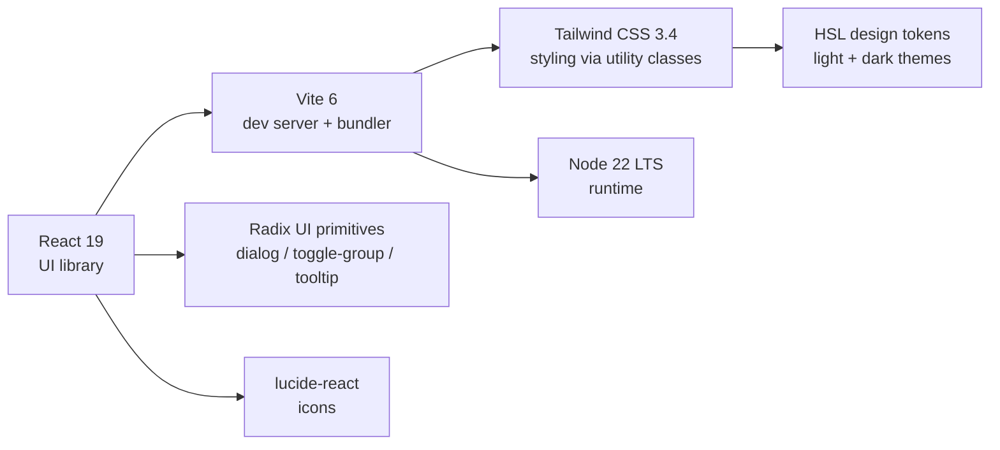
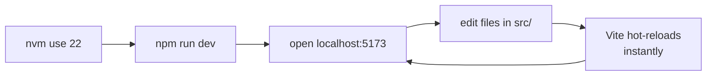
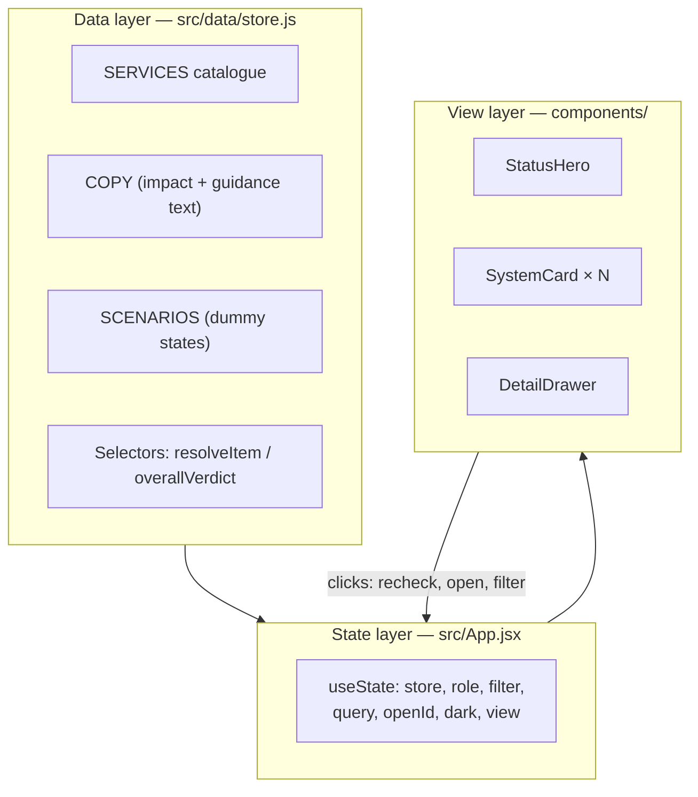
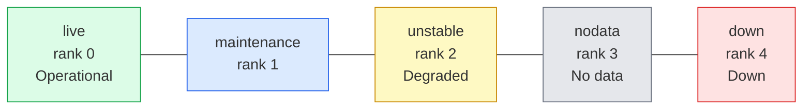
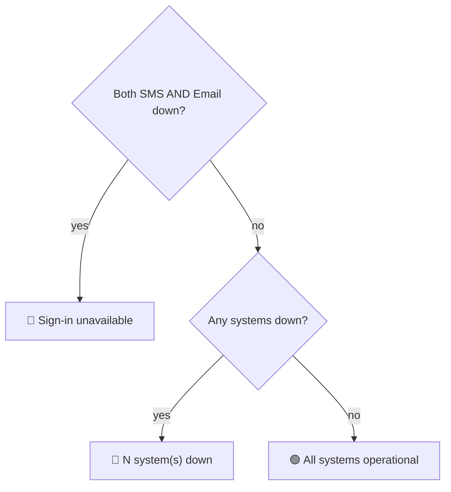
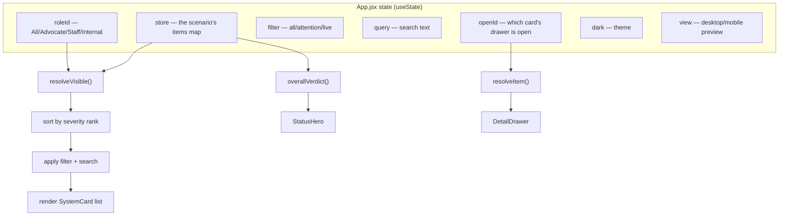
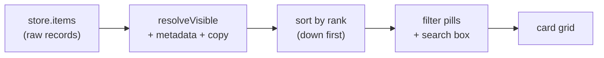
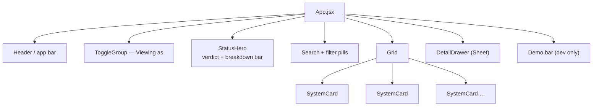
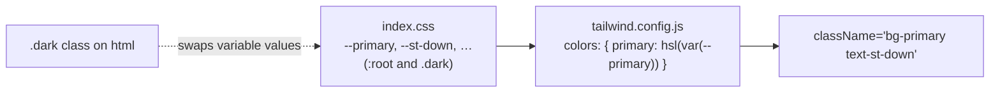
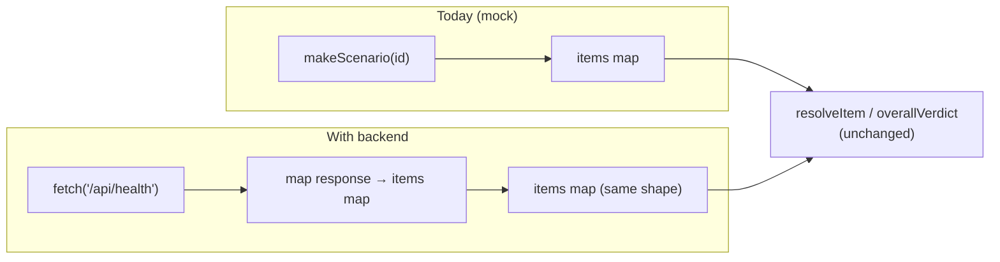

# OnCourts — Integration Status Dashboard · Developer Guide

A complete walkthrough of this codebase for a developer picking it up for the
first time. Covers **what** it is, **why** it exists, **how** it is wired
together, and **how to extend it** when the real backend arrives.

> **TL;DR** — A front-end-only React dashboard that shows the live health of
> OnCourts' external integrations (e-Payment, SMS, e-Sign, …). Everything is
> **mock data** today; the component tree is designed so that when the backend
> health API lands, you replace one file (`src/data/store.js`) and nothing else.

---

## 1. Background — why this project exists

Tracked in [dristi#5807 "Public-Facing Health Dashboard"](https://github.com/pucardotorg/dristi/issues/5807).

Users of the Kerala Courts platform need a page that tells them, in plain
language, **which integrations are working and what to do when one is down**
(e.g. "e-Payment is down — please retry later; avoid repeat attempts to prevent
a double charge").

The work splits in two:

| Part | Status | This repo |
|---|---|---|
| **Backend** polling service + status table + admin override | *not finalised* | ❌ out of scope |
| **Frontend** public status page (responsive, with dummy data) | *in progress* | ✅ **this repo** |

Because the backend contract isn't final, **every status, timestamp and message
in this app is illustrative dummy data.** The goal was to build the full UI from
the Figma handover so it is ready to plug into the real API later.

### Scope decisions locked in the ticket (reflected in the code)

- **Statuses:** only **Down** and **Operational** in v1 (Degraded / Maintenance /
  No-data exist in the data model for the future, but aren't surfaced in the demo toggles).
- **Snapshot only** — no historical uptime graphs.
- **No action-blocking** — the dashboard never blocks payments/e-sign; it only *informs*.
- **Perspectives** — All · Advocate · Court staff · Internal (grouping labels only for now).

---

## 2. Tech stack



| Layer | Choice | Why |
|---|---|---|
| Framework | **React 19** | Latest; hooks-only, no class components. |
| Build tool | **Vite 6** | Fast dev server + HMR; simple config. |
| Styling | **Tailwind CSS 3.4** | Utility-first; design tokens map 1:1 to the Figma handover. |
| Primitives | **Radix UI** | Accessible, unstyled dialog/toggle/tooltip (the shadcn/ui pattern). |
| Icons | **lucide-react** | Clean, tree-shakeable SVG icons. |
| Runtime | **Node 22 LTS** | Required by Vite 6 (Node 18+). |

> **Why Tailwind v3.4 and not v4?** v3.4's `tailwind.config.js` token model maps
> directly to the handover's colour variables, guaranteeing pixel fidelity. A v4
> migration is possible later but wasn't needed for v1.

---

## 3. Getting started

```bash
# 1. Use the right Node (your machine's default node may be too old for Vite)
nvm use 22                       # needs Node 18+, tested on 22.22

# 2. Install dependencies (only once, or after dependency changes)
npm install

# 3. Run the dev server
npm run dev                      # http://localhost:5173

# Other commands
npm run build                    # production build → dist/
npm run preview                  # serve the production build locally
```

> 💡 Run `nvm alias default 22` once so new terminals default to Node 22 and you
> can skip `nvm use 22` every time.

### Everyday loop



---

## 4. Directory structure

```
public-health-dashboard/
├── index.html                 # HTML shell; loads Noto Sans font + main.jsx
├── package.json               # deps + scripts
├── vite.config.js             # Vite + the "@" → "src" path alias
├── tailwind.config.js         # design tokens (colours, fonts, radius)
├── postcss.config.js          # runs Tailwind + autoprefixer
├── README.md                  # quick start
├── PROJECT_GUIDE.md           # (this file)
└── src/
    ├── main.jsx               # React entry — mounts <App/> into #root
    ├── index.css              # Tailwind layers + CSS design tokens (:root / .dark)
    ├── App.jsx                # page shell: state, layout, demo bar  ← the brain
    ├── data/
    │   └── store.js           # ALL mock data + selectors            ← the data layer
    ├── lib/
    │   ├── utils.js           # cn() — merges Tailwind class strings
    │   └── ui.jsx             # status→colour map, IST time helpers, StatusDot/Badge
    └── components/
        ├── StatusHero.jsx     # "Integration health" summary + breakdown bar
        ├── SystemCard.jsx     # one integration tile
        ├── DetailDrawer.jsx   # slide-in detail panel
        └── ui/                # Radix-based primitives (shadcn/ui style)
            ├── button.jsx
            ├── sheet.jsx          # the slide-in drawer container
            ├── toggle.jsx         # shared toggle styles (variants)
            ├── toggle-group.jsx   # the "Viewing as" / filter pills
            └── tooltip.jsx
```

### Mental model: three layers



**The key idea:** components are dumb renderers. All truth lives in `store.js`
(the data) and `App.jsx` (the current selections). Swap `store.js` for real API
calls and the view layer doesn't change.

---

## 5. The data layer — `src/data/store.js`

This is the most important file to understand. It defines the domain and all the
mock data.

### 5.1 Status taxonomy

```js
STATUS = { live, maintenance, unstable, nodata, down }   // each has a `rank`
```

`rank` drives sort order (most severe first). In **v1 only `live` and `down`**
are exercised by the demo; the others are wired for the future.



### 5.2 The catalogue — `SERVICES`

Six monitored integrations. Each row declares its metadata:

| id | name | vendor | needsAuth | audience |
|---|---|---|---|---|
| `epayment` | e-Payment | e-Treasury | ✅ | everyone |
| `sms` | SMS | CDAC | — | everyone |
| `email` | Email | NIC | — | everyone |
| `esign` | e-Sign | CDAC / CCA | ✅ | everyone |
| `aadhaar` | Aadhaar Auth | UIDAI | — | everyone |
| `icops` | iCOPS | State Police | — | court only |

- **`audience`** controls role visibility — `icops` is court-only, so Advocates never see it.
- **`needsAuth`** means "this service needs OTP login to work" — used to show a
  cascade warning ("Sign-in is down, so this will also fail").
- **`capability`** = what it does (shown when healthy); **`affects`** = the
  consequence (shown when down).

### 5.3 Authored copy — `COPY`

For each service × status, human-written **impact** text and a list of
**actions** (`{ a: "user" | "team", t: "..." }`). Only `a: "user"` actions show
in the public "What you can do" list. This is where all the descriptive dummy
guidance lives.

### 5.4 Scenarios — the dummy "database snapshots"

```js
SCENARIOS = [
  { id: "incident", label: "Incident",        hint: "One system down" },
  { id: "default",  label: "All operational", hint: "Healthy" },
  { id: "bothdown", label: "Sign-in down",    hint: "Both OTP channels down" },
]
```

`makeScenario(id)` builds the initial `items` map (each service → `{ status,
since, lastChecked }`). This stands in for what the backend polling table will
eventually return.

### 5.5 Selectors — deriving what the UI shows

Pure functions that turn raw records into render-ready data:

- **`resolveItem(id, items, now)`** — merges a service's metadata + record +
  authored copy into one object (adds `impact`, `actions`, `cascade`, duration…).
- **`resolveVisible(items, now, role)`** — the list for the current role.
- **`overallVerdict(items, now, role)`** — the hero headline.
- **`loginState(items)`** — is sign-in possible? (SMS **or** Email up).

### 5.6 The verdict decision tree

How the big headline at the top is chosen:



`loginState` is special-cased because if both OTP channels are down, **nobody
can log in** — a bigger deal than "2 systems down", so it gets its own headline.

---

## 6. The state layer — `src/App.jsx`

`App.jsx` owns all interactive state and passes data down as props.



### Data pipeline (raw records → pixels)



### Interactions and what they mutate

| Action | Handler | Effect |
|---|---|---|
| Click a card | `setOpenId` | opens the detail drawer |
| **Re-check** (card/drawer) | `recheck(id)` | bumps that item's `lastChecked` (800 ms fake "checking…", then 5 s throttle) |
| **Refresh all** (hero) | `recheckAll` | bumps `lastChecked` on every item |
| **Viewing as** pills | `setRoleId` | changes which services are visible |
| Filter pills / search | `setFilter` / `setQuery` | narrows the grid |
| Dark-mode button | `setDark` | toggles the `.dark` class on `<html>` |
| **Demo bar** (scenario / flip / mobile) | `loadScenario` / `flipStatus` / `setView` | dev-only controls to explore states |

> The **demo bar** at the bottom is a development affordance (scenario switch,
> per-system Down/Operational flip, and a phone-frame mobile preview). It's
> hidden when the app runs embedded (`?embed=1`). Remove it before production.

---

## 7. The view layer — components



- **`StatusHero.jsx`** — the page anchor. Shows the verdict headline + a
  parts-of-whole "status breakdown" bar (desktop: labelled segments; mobile:
  continuous bar + legend) and the **Refresh all** button.
- **`SystemCard.jsx`** — one integration. Status leads the read via a coloured
  **label + left rail** (never colour alone → accessible). Down cards get a red
  tint and a "since HH:MM". Footer has last-checked + **Re-check**.
- **`DetailDrawer.jsx`** — a Radix Dialog rendered as a right-side **Sheet**
  (full-screen on mobile). Shows status badge, timing, plain-language impact,
  optional cascade/note, "What you can do", and **Re-check** + **Report a problem**.
- **`components/ui/*`** — the shadcn/ui-style Radix primitives. You rarely touch
  these; they're the accessible building blocks (`Button`, `Sheet`,
  `ToggleGroup`, `Tooltip`).

---

## 8. Styling & theming — `index.css` + `tailwind.config.js`

Colours are **HSL CSS variables** defined twice — once under `:root` (light) and
once under `.dark`. Tailwind maps semantic class names to those variables.



- **Semantic tokens:** `background`, `foreground`, `card`, `primary` (eCourts
  teal), `muted-foreground`, `border`, …
- **Status tokens:** `st-live`, `st-down`, `st-unstable`, `st-maint`, `st-nodata`
  — each with a base text colour, a soft `-bg` fill, and a `-bd` border.
- **Dark mode** = toggling the `.dark` class on `<html>` (done in `App.jsx`),
  which flips every variable to its dark value. No component changes needed.

The `STATUS_UI` map in `lib/ui.jsx` is the single source that ties a status id to
its label + Tailwind classes:

```js
STATUS_UI.down = { label: "Down", text: "text-st-down",
                   badge: "border-st-down-bd bg-st-down-bg text-st-down",
                   dot: "bg-st-down" }
```

---

## 9. Accessibility notes (built in, keep them)

- **Status never relies on colour alone** — always label + colour + position (the left rail).
- High-contrast text (no faint grey), visible borders (bad-monitor friendly).
- Cards are keyboard-operable (`role="button"`, Enter/Space open the drawer).
- Focus rings on every interactive element; Radix handles focus-trapping in the drawer.
- Respects `prefers-reduced-motion` (the entrance animation disables itself).

---

## 10. How to extend

### Add a new integration
1. Add a row to `SERVICES` in `store.js` (id, name, vendor, capability, affects, audience).
2. Add its `COPY[id]` block (impact + actions per status).
3. Done — it appears automatically in the grid and counts.

### Add / change dummy states
- Edit `scenarioRecords()` in `store.js`, or use the **Flip systems** demo control at runtime.

### Wire in the real backend (the big one)
Replace the mock scenario with fetched data — the selectors and components stay put:



Concretely: in `App.jsx`, swap `useState(() => makeScenario(...))` for a
`useEffect` that fetches the health endpoint and `setStore` with a matching
`{ name, items }` shape. Also plan for the **admin override** and **Report a
problem** endpoints from the ticket.

---

## 11. What was built so far (change log)

- **Scaffolding:** Vite + React 19 project; `@`→`src` alias; Tailwind 3.4 + PostCSS.
- **Design tokens:** full light/dark HSL token set in `index.css`; Tailwind mapping.
- **UI primitives:** Radix-based `button`, `sheet`, `toggle`, `toggle-group`, `tooltip`.
- **Data layer:** `store.js` with 6 integrations, per-status impact/guidance copy,
  3 scenarios, and role-aware selectors + verdict logic (all dummy data).
- **Components:** `StatusHero`, `SystemCard`, `DetailDrawer`.
- **App shell:** app bar, "Viewing as" perspective switch, search + filter pills,
  responsive card grid, footnotes, and a dev-only demo bar (scenario / flip /
  mobile preview).
- **All 8 Figma screens reproduced** (desktop operational/incident/sign-in-down/advocate + detail; mobile operational/incident + detail).
- **Verified:** clean `npm install`, passing `npm run build`, dev server serves on :5173.

---

## 12. Quick reference — where do I change…?

| I want to change… | File |
|---|---|
| The dummy statuses / which system is down | `src/data/store.js` → `scenarioRecords` |
| The impact text or user guidance | `src/data/store.js` → `COPY` |
| A service's name/vendor/visibility | `src/data/store.js` → `SERVICES` |
| Status label or colour | `src/lib/ui.jsx` (`STATUS_UI`) + `src/index.css` (tokens) |
| The overall headline logic | `src/data/store.js` → `overallVerdict` |
| Page layout / header / toolbar | `src/App.jsx` |
| A card's look | `src/components/SystemCard.jsx` |
| The detail panel | `src/components/DetailDrawer.jsx` |
| Theme colours / fonts | `src/index.css` + `tailwind.config.js` |
| The "Report a problem" link | `src/components/DetailDrawer.jsx` (`REPORT_URL`) |
```
